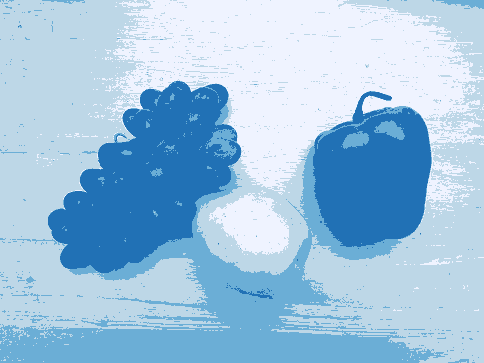

# CV Project 1: Otsu's Method

Hongyu Zhai (`hz2162`)


## Compile the Program

This project requires CMake and compiler toolchain on your platform. Since the project only uses standard libraries and a header-only library to read/write images, it should be very portable.

To run the program, type the following commands

```bash
mkdir build
cd build
cmake ..
cmake --build .
./cv-project-otsu.exe
```

The program uses hard-coded path for input images. So, do not remove images in `images` and make sure to run the executable in `build`.


## The Output Images

**test image 1**

t1 = 76, t2 = 154, t3 = 221

**test image 2**

t1 = 87, t2 = 139, t3 = 171

**test image 3**

t1 = 44, t2 = 104, t3 = 174


## Source Code (`main.cpp`)

```cpp
// standard headers
#include <cmath>
#include <limits>
#include <vector>
#include <iostream>

// STB for reading/writing images
#define STB_IMAGE_IMPLEMENTATION
#include "stb_image.h"
#define STB_IMAGE_WRITE_IMPLEMENTATION
#include "stb_image_write.h"

// helper macro for logging errors
#define __LOG_ERROR(msg) do {\
    std::cerr << __func__ << ":"   \
              << __LINE__ << ":"   \
              << msg << std::endl; \
} while (0);

// typedefs for convenience
typedef unsigned char uchar;

typedef struct __ImageData {
    int width{0};
    int height{0};
    int channels{0};
    uchar* pixels{nullptr}; // greyscale pixels
} ImageData;

/**
 * Turn RGB into greyscale value.
 *
 * @param r (unsigned char) representing the Red value
 * @param g (unsigned char) representing the Red value
 * @param b (unsigned char) representing the Red value
 *
 * @return  (unsigned char) computed greyscale value
 */
static inline uchar greyScale(uchar r, uchar g, uchar b) {
   return static_cast<uchar> (std::round(0.299 * r + 0.587 * g + 0.114 * b));
}

/**
 * Load pixel values from an image.
 *
 * @param image    struct to store the image information
 * @param filename path to the image file
 *
 * @return  true if successfully read image, false otherwise
 */
static bool loadImage(ImageData &image, const char *filename) {

    // stop if file path is NULL
    if (!filename) {
        __LOG_ERROR("ErrorInvalid arguments")
        return false;
    }

    // load image data using STB
    int x, y, n;
    uchar *data = stbi_load(filename, &x, &y, &n, 0);

    // stop if STB failed to read image
    if (!data) {
        __LOG_ERROR("Failed to load image");
        return false;
    }

    // store image metedata
    image.width = x;
    image.height = y;
    image.channels = n;

    // convert RGB to greyscale and store the pixel values
    uchar r, g, b;
    image.pixels = new uchar[x * y];

    for (int i = 0; i < x * y; i++) {
        r = data[i * n + 0];
        g = data[i * n + 1];
        b = data[i * n + 2];

        image.pixels[i] = greyScale(r, g, b);
    }

    // clean up
    stbi_image_free(data);

    return true;
}

/**
 * Create output image with the specified name.
 *
 * Given the thresholds, assign color to each interval,
 * and create the output image in the current directory.
 *
 * @param filename name of the output image
 * @param image    struct containing image information
 * @param t1       the first threshold
 * @param t2       the second threshold
 * @param t3       the third threshold
 *
 */
static void writeOutputImage(const char* filename, const ImageData &image, unsigned t1, unsigned t2, unsigned t3) {

    int numPixels = image.width * image.height;

    // array of pixel values for the output image
    uchar *output = new uchar[numPixels * 3];

    // colors from https://observablehq.com/@d3/color-schemes
    //     Sequential (Single-Hue): Blues (4)
    for (int i = 0; i < numPixels; i++) {
        // assign color to the interval [0, t1]
        if (image.pixels[i] >= 0 && image.pixels[i] <= t1) {
            output[i * 3 + 0] = 0x05;
            output[i * 3 + 1] = 0x70;
            output[i * 3 + 2] = 0xB0;
        }

        // assign color to the interval (t1, t2]
        else if (image.pixels[i] > t1 && image.pixels[i] <= t2){
            output[i * 3 + 0] = 0xF1;
            output[i * 3 + 1] = 0xEE;
            output[i * 3 + 2] = 0xF6;
        }

        // assign color to the interval (t2, t3]
        else if (image.pixels[i] > t2 && image.pixels[i] <= t3){
            output[i * 3 + 0] = 0xBD;
            output[i * 3 + 1] = 0xC9;
            output[i * 3 + 2] = 0xE1;
        }

        // assign color to the interval (t3, 255]
        else if (image.pixels[i] > t3) {
            output[i * 3 + 0] = 0x74;
            output[i * 3 + 1] = 0xA9;
            output[i * 3 + 2] = 0xCF;
        }
    }

    // write pixel values to an output image
    stbi_write_bmp(filename, image.width, image.height, 3, output);
}

/**
 * Compute the within group variance.
 *
 * Given a histogram H, compute the variance of pixels
 * with t in range [t_lo, t_hi].
 *
 * @param H    the histogram
 * @param t_lo start of the index
 * @param t_hi end of the index
 *
 * @return the within group variance
 */
static float inGroupVariance(const std::vector<int> &H, unsigned t_lo, unsigned t_hi) {
    int numPixels = 0;
    float mean = 0.0f, variance = 0.0f;

    // count the number of pixels with grey value in [s, e]
    for (unsigned t = t_lo; t <= t_hi; t++)
        numPixels += H[t];

    // compute the mean value
    for (unsigned t = t_lo; t <= t_hi; t++)
        mean += t * H[t];

    mean /= static_cast<float>(numPixels);

    // compute the variance
    for (unsigned t = t_lo; t <= t_hi; t++)
        variance += H[t] * std::pow(t - mean, 2);

    variance /= static_cast<float>(numPixels);

    return variance;
}

/**
 * Compute the weighted sum of within group varicance.
 *
 * @param H         the histogram
 * @param numPixels number of pixels in the input image
 * @param t1        the first threshold
 * @param t2        the second threshold
 * @param t3        the third threshold
 *
 * @return the intra-group variance for Otsu's algorithm
 */
static float evaluateThresholds(const std::vector<int> &H, int numPixels, unsigned t1, unsigned t2, unsigned t3) {
    unsigned G = static_cast<unsigned>(H.size());

    // compute the weights of each group
    float w0 = 0.0f, w1 = 0.0f, w2 = 0.0f, w3 = 0.0f;

    for (unsigned t = 0; t < G; t++) {
        if (t >= 0 && t <= t1)
            w0 += H[t] / static_cast<float>(numPixels);

        else if (t > t1 && t <= t2)
            w1 += H[t] / static_cast<float>(numPixels);

        else if (t > t2 && t <= t3)
            w2 += H[t] / static_cast<float>(numPixels);

        else if (t > t3 && t <= 255)
            w3 += H[t] / static_cast<float>(numPixels);
    }

    // compute variance for each group
    float varGroup0 = inGroupVariance(H, 0,    t1);
    float varGroup1 = inGroupVariance(H, t1+1, t2);
    float varGroup2 = inGroupVariance(H, t2+1, t3);
    float varGroup3 = inGroupVariance(H, t3+1, G-1);

    return (w0 * varGroup0 + w1 * varGroup1 + w2 * varGroup2 + w3 * varGroup3);
}

/**
 * Extended Otsu's algorithm for automatic thresholding.
 *
 * @param image  struct containing the image data
 * @param t1     first threshold will be stored here
 * @param t2     second threshold will be stored here
 * @param t3     third threshold will be stored here
 *
 */
static void otsu(const ImageData &image, unsigned &t1, unsigned &t2, unsigned &t3) {

    // create and populate the histogram
    std::vector<int> histogram(256, 0);
    int imageSize = image.width * image.height;

    for (int i = 0; i < imageSize; i++) {
        uchar grey = image.pixels[i];
        histogram[grey] += 1;
    }

    float currentMin = std::numeric_limits<float>::max();

    // try each combination of (t1, t2, t3)
    for (unsigned i = 0; i < 256; i++) {
        for (unsigned j = i + 1; j < 256; j++) {
            for (unsigned k = j + 1; k < 256; k++) {

                // compute the intra-group variance
                float val = evaluateThresholds(histogram, imageSize, i, j, k);

                // update minimum seen so far
                if (val < currentMin) {
                    currentMin = val;
                    t1 = i; t2 = j; t3 = k;
                }
            }
        }
    }
}

/**
 * Run Otsu's algorithm on one image and write result.
 *
 * @param filepath filepath to the input image
 * @param output   name of the output image
 *
 */
void task(const char *filepath, const char* output) {
    ImageData img;

    // stop if failed to load image
    if (!loadImage(img, filepath)) {
        __LOG_ERROR("Failed to load image")
        return;
    }

    printf("Loaded pixel values from %s\n", filepath);

    // running the extended Otsu's algorithm
    unsigned t1, t2, t3;
    otsu(img, t1, t2, t3);

    printf("%s: t1 = %d, t2 = %d, t3 = %d\n", filepath, t1, t2, t3);

    // write the output image
    writeOutputImage(output, img, t1, t2, t3);

    printf("Written to %s\n\n", output);

}

int main() {

    task("../images/data13.bmp", "data13_output.bmp");
    task("../images/fruits2b.bmp", "fruits2b_output.bmp");
    task("../images/tiger1-24bits.bmp", "tiger1-24bits_output.bmp");

    return 0;
}

#undef __LOG_ERROR
```